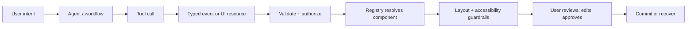

# Awesome Agentic UX & Generative UI 🎨🤖

A curated list of protocols, runtimes, design patterns, and benchmarks for building **generative user interfaces (GenUI)** and **agent-native user experiences**.

Software is moving from fixed screens toward intent-driven, ephemeral interfaces. This list tracks the protocols and primitives that let an agent stream state, select safe components, and collaborate with people in the workspace.

> **The useful question is not “Can the model draw a screen?”** It is “Which UI should appear for this intent, what can it safely change, and how does the user stay in control?”

### Start here

| You are building… | Start with… | Why |
| --- | --- | --- |
| A chat assistant that can take actions | [AG-UI](https://docs.ag-ui.com/) + [CopilotKit](https://docs.copilotkit.ai/) | Stream lifecycle, tool, and state events into an existing product shell |
| A tool that returns an interactive surface | [MCP Apps](https://modelcontextprotocol.io/docs/extensions/apps) + [MCP-UI](https://github.com/idosal/mcp-ui) | Return a bounded UI resource next to a tool result |
| A typed component registry for React | [Tambo](https://tambo.co/) or [assistant-ui](https://www.assistant-ui.com/) | Map validated agent output to known components |
| A generated interface for a new product idea | [v0](https://v0.dev/) or [Bolt](https://bolt.new/) | Explore a static code surface before adding runtime hydration |
| A safety or quality evaluation plan | [EvoGenUI-Bench](https://arxiv.org/abs/2411.02509) + the rubric below | Measure interaction and state, not only screenshots |

**Maturity key:** `Stable surface` means a maintained product or published protocol; `Active` means usable with a moving API; `Research` means a paper, prototype, or search-led entry that needs verification.

## Contents

- [Protocols & Specifications](#protocols--specifications)
- [Runtime Frameworks & SDKs](#runtime-frameworks--sdks)
- [Design Systems & Elastic Primitives](#design-systems--elastic-primitives)
- [Agentic UX Design Patterns](#agentic-ux-design-patterns)
- [Benchmarks & Evaluation](#benchmarks--evaluation)
- [Real-World Applications & Demos](#real-world-applications--demos)
- [Text-to-Code vs Text-to-Hydration](#text-to-code-vs-text-to-hydration)
- [Contributing](#contributing)

## Protocols & Specifications

Standards and schemas for communication between an AI agent, application state, and a UI renderer.

- [Model Context Protocol (MCP)](https://modelcontextprotocol.io/) *(Stable surface)* — Open protocol for connecting models to tools and data; useful as the tool layer behind UI-producing agent actions.
- [MCP-UI](https://github.com/idosal/mcp-ui) *(Active)* — Open-source MCP extension for returning interactive UI resources alongside tool results.
- [MCP Apps](https://modelcontextprotocol.io/docs/extensions/apps) *(Stable surface)* — MCP extension model for servers that provide interactive surfaces inside compatible hosts.
- [OpenAI Apps SDK](https://developers.openai.com/apps-sdk/) *(Active)* — Build apps that extend ChatGPT with tools and UI components; a useful reference for host-mediated agent surfaces.
- [AG-UI](https://docs.ag-ui.com/) *(Active)* — Event-based protocol for synchronizing agent lifecycle, tool calls, state, and streamed UI updates with a client.
- [A2UI](https://a2ui.org/) *(Active)* — Declarative, component-based approach for agents to describe UI that a client renders from its own trusted catalog.
- [OpenUI](https://github.com/wandb/openui) *(Research)* — Research-oriented interface for describing UI in natural language and rendering it from a component vocabulary.
- [SchemaGUI](https://arxiv.org/search/?query=SchemaGUI&searchtype=all) *(Research)* — Research direction around compact UI schemas and constrained generation; verify the paper/repository status before production use.

## Runtime Frameworks & SDKs

Libraries that stream agent output or hydrate runtime components from structured events.

- [Vercel AI SDK](https://ai-sdk.dev/) *(Active)* — TypeScript toolkit for model calls, tool invocation, streaming, and generative UI patterns; `streamUI` is documented for the RSC integration.
- [CopilotKit](https://docs.copilotkit.ai/) *(Active)* — In-app copilot and agent infrastructure with shared application state and human-in-the-loop actions.
- [Tambo](https://tambo.co/) *(Active)* — React framework for registering components and rendering them from typed agent tool calls.
- [assistant-ui](https://www.assistant-ui.com/) *(Active)* — React primitives for assistant experiences, threads, tool results, and generative UI surfaces.
- [Thesys C1](https://www.thesys.dev/) — API-compatible generative UI system that returns structured, interactive interfaces rather than plain text alone.
- [Crayon](https://crayon.ai/) — Generative UI runtime and component approach focused on turning model output into interactive product surfaces.
- [Cuttlekit](https://github.com/search?q=cuttlekit&type=repositories) — Experimental framework direction for lightweight, framework-agnostic generative UI; the search link is used because the project location may move.
- [mdocUI](https://github.com/mdocui/mdocui) — Markdoc-oriented experimental UI rendering approach; treat as an early-stage project and verify current maintenance.

## A small protocol-to-pixel map

The boundary to protect is between `typed event` and `component`. The model can propose a payload; the application decides whether it is valid, permitted, renderable, and reversible.

## Design Systems & Elastic Primitives

Patterns for making non-deterministic model output safe, accessible, and layout-stable.

- **Component Allowlist Strategy** — Let the model choose from registered, tested components (for example Radix or shadcn/ui) and fill typed props; never accept arbitrary HTML/CSS as the default path.
- **Dynamic Widget Registries** — Map a tool name and validated payload to a widget through a versioned registry, with an explicit fallback for unknown tools.
- **Spatial Guardrails & Elastic Layouts** — Use bounded grids, min/max dimensions, overflow rules, and responsive slots so a variable number of cards, rows, or charts cannot break the shell.
- **Schema-first props** — Validate model payloads at the boundary, coerce only safe fields, and preserve a stable component API while copy and data evolve.
- **Accessible state primitives** — Keep focus order, loading, empty, error, and permission states in the component contract instead of asking the model to invent them.

## Agentic UX Design Patterns

Patterns for helping people understand, steer, and safely approve agent work.

- **Thought-Process Externalization** — Show user-safe progress such as “Searching orders” or “Draft ready”; expose status and evidence, not private chain-of-thought.
- **Human-in-the-Loop & Staged Commits** — Separate preview, validation, approval, and execution for payments, deletes, publishing, and other irreversible actions.
- **Co-Creator Workspaces (Chat+ and Chatless UI)** — Let an agent update a table, document, canvas, or dashboard directly while chat remains an optional control surface.
- **Progressive Disclosure & Ephemeral Interfaces** — Surface the smallest useful control for the current intent, then collapse or retire it when the task is complete.
- **Recoverable actions** — Make changes diffable, undoable, and attributable to a tool call so users can correct an agent without starting over.
- **Permission-aware rendering** — Render only data and actions the current user can access; treat authorization as a backend invariant, not a visual hint.

## Benchmarks & Evaluation

Research and engineering methods for evaluating generated UI beyond screenshot similarity.

- [EvoGenUI-Bench](https://arxiv.org/abs/2411.02509) — Benchmark for multi-turn generative UI interaction, state, and task completion.
- [LEGOUI](https://arxiv.org/search/?query=LEGOUI&searchtype=all) — Research line focused on compositional and geometric UI generation; use the primary paper/repository linked from the latest result.
- [SchemaGUI research](https://arxiv.org/search/?query=SchemaGUI&searchtype=all) — Schema-constrained generation and evaluation of UI structure.
- [Maru research](https://arxiv.org/search/?query=Maru%20generative%20UI&searchtype=all) — Research search for maintaining context and interface consistency across multi-turn generation.
- **Suggested evaluation axes** — task success, interaction validity, schema adherence, visual/layout constraints, accessibility, latency, recovery rate, and user trust calibration.

## Real-World Applications & Demos

These are concrete places to see the ideas in action:

- [MCP-UI examples](https://github.com/idosal/mcp-ui/tree/main/examples) — Interactive resources returned from MCP tools.
- [AG-UI examples](https://github.com/ag-ui-protocol/ag-ui) — Agent events, state synchronization, and client integrations.
- [OpenAI Apps SDK examples](https://github.com/openai/openai-apps-sdk-examples) — Tool-backed apps and components for ChatGPT hosts.
- [assistant-ui examples](https://github.com/assistant-ui/assistant-ui/tree/main/examples) — React assistant surfaces and tool-result UI.

When adding a demo, describe the user action and the visible state transition. Useful demo types include:

- an MCP server returning an interactive approval card;
- a tool call hydrating a chart or editable table in a workspace;
- a multi-step agent action with preview → approval → commit;
- an ephemeral UI that appears for one intent and disappears after completion.

Screenshots and GIFs belong in `media/` or in a linked project; see [media guidance](media/README.md). This starter repository intentionally does not invent demo assets.

## Text-to-Code vs Text-to-Hydration

| Dimension | Text-to-Code | Text-to-Hydration |
| --- | --- | --- |
| Output | Source code, markup, or a generated app | Typed data/events that fill registered runtime components |
| Example | [v0](https://v0.dev/), [Bolt](https://bolt.new/) | AG-UI events, MCP-UI resources, Tambo/CopilotKit component registries |
| When it runs | Build time or a code-generation session | During an active agent task, often incrementally |
| Main risk | Unsafe or brittle generated code | Invalid props, layout overflow, permission leaks, stale state |
| Core guardrail | Review, tests, linting, sandboxing | Allowlists, schemas, authorization, spatial constraints, staged commits |

Text-to-Code can be the right way to bootstrap a product surface. Text-to-Hydration is the better mental model when the shell is known and the agent needs to adapt the content, controls, and workflow at runtime.

## Evaluation starter card

For each demo or framework, record one happy path and one recovery path:

| Check | Example question |
| --- | --- |
| Intent fit | Did the UI expose the next useful action for the user's goal? |
| State continuity | Did the component keep edits and context across turns? |
| Contract safety | Were tool payloads validated, authorized, and bounded? |
| Interaction quality | Can users undo, retry, or correct an agent action? |
| Layout/accessibility | Do long labels, empty states, keyboard focus, and errors remain usable? |
| Trust calibration | Does the UI show enough evidence without implying certainty the agent does not have? |

## Contributing

See [contributing.md](contributing.md) for entry quality, source, taxonomy, and media rules.

## License

This curated list is released under [CC0 1.0](LICENSE). Linked projects retain their own licenses.
