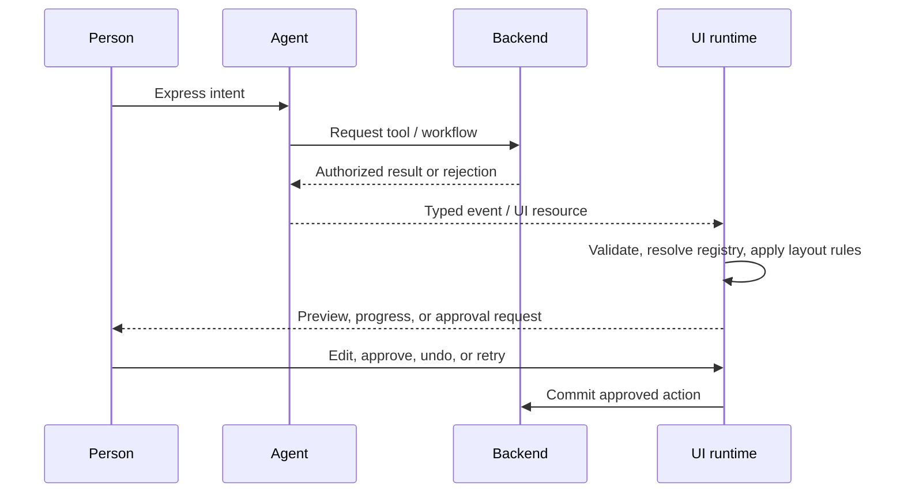

# Core Concepts

## The runtime loop

1. A user expresses an intent.
2. The agent selects a tool or workflow.
3. The backend authorizes the action and validates its input.
4. The agent emits typed events: progress, data, UI resource, approval request, or completion.
5. The client resolves the event through a component allowlist and widget registry.
6. The renderer applies spatial and accessibility guardrails.
7. The user reviews, edits, approves, or recovers the result.

The model proposes; the application owns authorization, validation, layout bounds, and irreversible commits.

## Text-to-Code and Text-to-Hydration

Text-to-Code is a code-generation workflow. It produces source files that must pass normal review, tests, linting, and security checks.

Text-to-Hydration is a runtime workflow. A known component receives typed data or an event from an agent. The implementation should keep the component registry, schema validation, and permission checks outside the model's control.

## Elastic primitives

- Allowlisted components define the maximum UI vocabulary.
- Typed props define what data may enter a component.
- Widget registries define tool-to-component mapping and versioning.
- Spatial guardrails define min/max sizes, slot counts, overflow, and responsive behavior.
- Deterministic states define loading, empty, error, permission, and fallback rendering.

## Safety and trust

For consequential work, use preview → validate → approve → commit. Show concise progress and evidence rather than private chain-of-thought. Keep authorization server-side and make changes attributable, reversible, and auditable.

## Evaluation starter rubric

Evaluate generated interfaces on task completion, valid interaction paths, schema adherence, layout constraints, accessibility, latency, multi-turn consistency, recovery quality, and calibrated user trust.

For a practical review, capture two traces for each scenario:

- **Happy path:** intent → tool → rendered component → successful completion.
- **Recovery path:** invalid input, permission denial, timeout, or user correction → clear fallback → retry/undo.

The recovery trace is often more revealing than a polished screenshot because it tests whether the runtime owns its boundaries.
